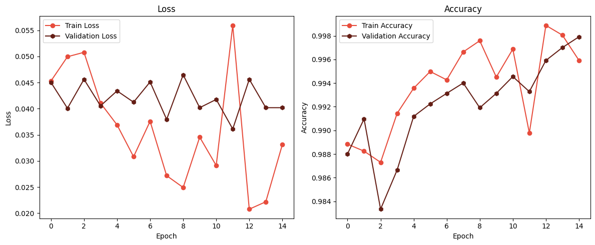
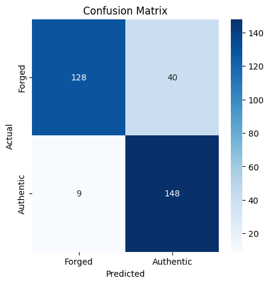
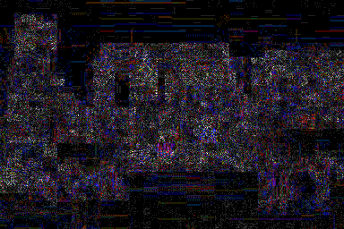
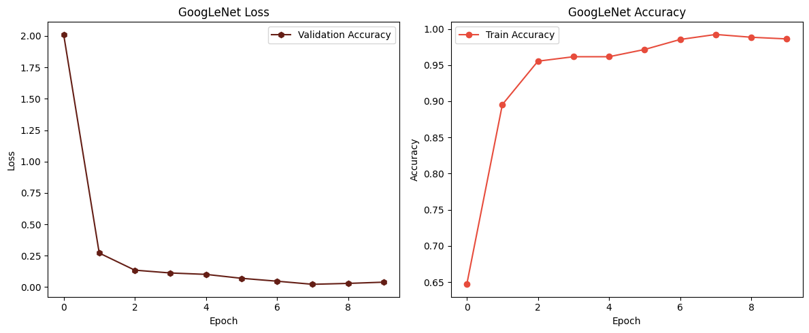
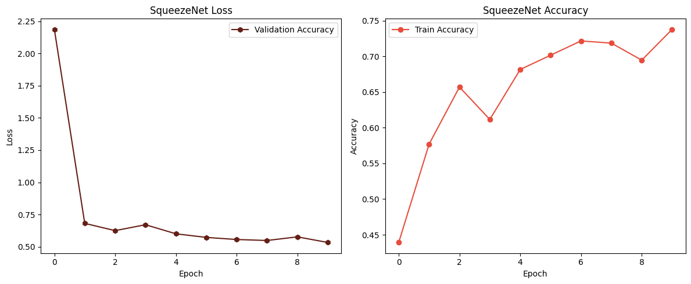
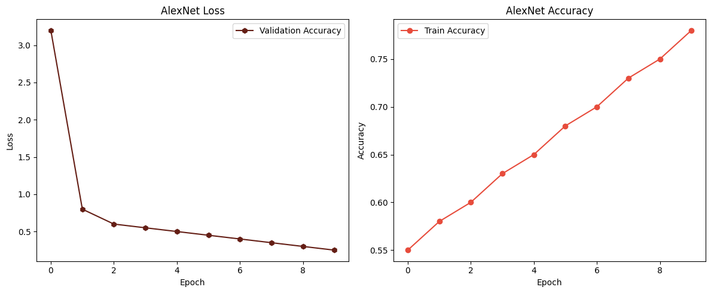

# CNN for Image Forgery Detection ELA-based

This project presents a Jupyter notebook that aims to recreate an ELA-based model capable of discriminating whether an input image is authentic or forged.

# Progetto_itinere2_DF

This project presents a Jupyter notebook that aims to recreate an ELA-based (Error Level Analysis) model capable of discriminating whether an input image is authentic or forged.

## Project Overview

Image authenticity verification is a crucial task in many applications, including digital forensics, media verification, and fraud detection. This project focuses on developing a convolutional neural network (CNN) model to classify images as authentic or forged using Error Level Analysis (ELA).

## Model Architecture

The model is built using Keras' Sequential API and consists of several convolutional layers, max-pooling layers, and a dense layer with a sigmoid activation function to output the final classification. Below is the model architecture:

```python
    model.add(Conv2D(filters = 64, kernel_size = (5, 5), padding = 'valid', activation = 'relu', input_shape = (128, 128, 3)))
    model.add(Conv2D(filters = 64, kernel_size = (5, 5), padding = 'valid', activation = 'relu'))
    model.add(MaxPool2D(pool_size = (2, 2)))
    model.add(Conv2D(filters = 64, kernel_size = (5, 5), padding = 'valid', activation = 'relu'))
    model.add(Conv2D(filters = 64, kernel_size = (5, 5), padding = 'valid', activation = 'relu'))
    model.add(MaxPool2D(pool_size = (2, 2)))
    model.add(Conv2D(filters = 64, kernel_size = (5, 5), padding = 'valid', activation = 'relu'))
    model.add(Conv2D(filters = 64, kernel_size = (5, 5), padding = 'valid', activation = 'relu'))
    model.add(MaxPool2D(pool_size = (2, 2)))
    model.add(Conv2D(filters = 32, kernel_size = (5, 5), padding = 'valid', activation = 'relu'))
    model.add(MaxPool2D(pool_size = (2, 2)))
    model.add(GlobalAveragePooling2D())
    model.add(Dense(1, activation = 'sigmoid'))
```

The learning curves are the following:



Evaluation measures includes :

- Confusion matrix



## Example of ELA map application

Here is an example of an ELA map applied to an image:




This map highlights areas of the image that may indicate forgery or manipulation. By analyzing the variations in the error levels, the ELA-based model can make predictions about the authenticity of the image.

## Model Comparison with GoogLeNet, SqueezeNet, and AlexNet

To assess the effectiveness of the ELA-based model, comparisons were made with well-known models in the literature such as GoogLeNet, SqueezeNet, and AlexNet. These models have been widely used for image classification tasks, each with its unique architecture and performance characteristics.

- **GoogLeNet**: Known for its deep and complex architecture with inception modules, GoogLeNet aims to achieve both high accuracy and efficiency in image classification tasks.



- **SqueezeNet**: Designed for mobile and embedded applications, SqueezeNet offers a lightweight yet powerful architecture that achieves competitive performance with fewer parameters.



- **AlexNet**: A pioneering architecture in deep learning for image classification, AlexNet is recognized for its effectiveness in large-scale image recognition tasks. With its straightforward design, it has set the foundation for many subsequent deep learning models.



The comparison involves evaluating classification accuracy, computational efficiency, and model size, highlighting strengths and weaknesses relative to the ELA-based approach.

## Usage

Clone the repository.

```bash
git clone git@github.com:nameisalfio/Progetto_itinere2_DF.git
```
Open the Jupyter notebook ELA.ipynb.
Follow the instructions in the notebook to run the code cells and reproduce the ELA-based image authenticity detection model.

## Requirements

- Python 3.x
- TensorFlow
- Keras
- Jupyter Notebook
